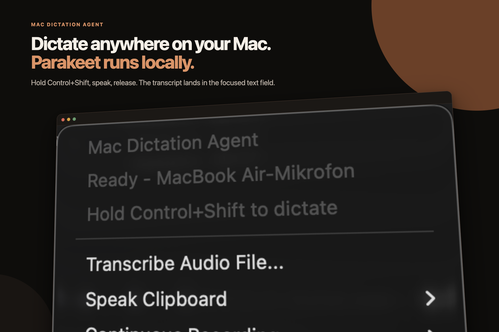
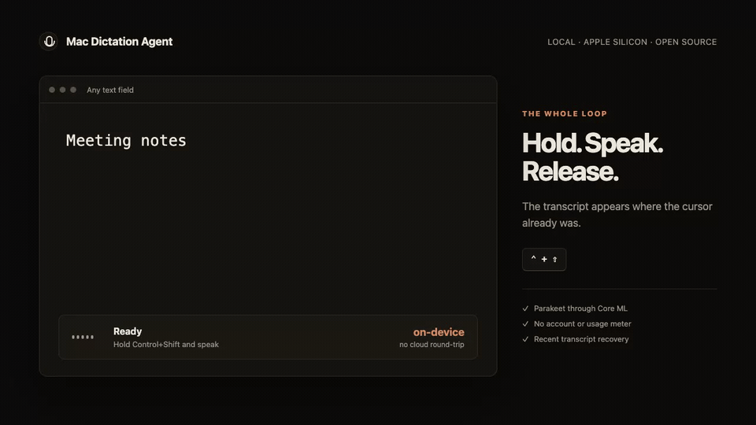
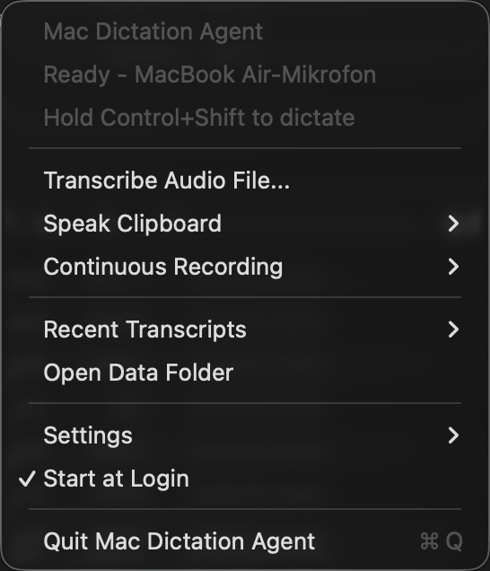

# Mac Dictation Agent



A local dictation app for Apple Silicon Macs.

Hold **Control+Shift**, speak, then release. Mac Dictation Agent transcribes your voice on the Mac and pastes the result into the field that was already focused.

[Download the latest release](https://github.com/markschroedr/mac-dictation-agent/releases/latest) · [Read how it works](https://schroedermark.com/blog/mac-dictation-agent/)



## Install

1. Download `Mac-Dictation-Agent-0.1.0-macOS-arm64.zip` from the latest release.
2. Unzip it.
3. Control-click **Install Mac Dictation Agent.command**, then choose **Open**.
4. Allow Microphone and Accessibility access when macOS asks.
5. Click a text field. Hold **Control+Shift**, speak, then release.

The app is ad-hoc signed, but not notarized. The Control-click step is required on the first install.

The core install needs no Homebrew, Python, Xcode, or cloud API. The first dictation downloads a local Parakeet model of about 460 MB.

The first dictation can take several minutes while the model downloads and Core ML prepares it. Later warm dictations finish much faster.

## The part I use every day

- Hold Control+Shift to start recording.
- Release both keys to transcribe and paste.
- Hold Option before releasing the shortcut to lock a long recording.
- Press Control+Shift once more to stop a locked recording.

The menu-bar icon shows when the app is recording or processing. Recent transcripts stay available from the menu if a paste lands in the wrong place.



## Measured speed

On my M4 MacBook Air, the local model transcribed a 6.70-second sentence in **0.53 seconds median** across five warm runs. That is **12.5× real time**. The fastest run took 0.44 seconds and the slowest took 0.90 seconds.

This measures model processing after capture, not the time spent speaking. Run the same benchmark on your Mac:

```bash
bash scripts/benchmark_dictation.sh /path/to/audio.wav 5
```

See [the benchmark method and raw result](docs/BENCHMARKS.md).

## Where it fits

This is a small open-source tool, not an attempt to out-polish commercial dictation apps.

| | Mac Dictation Agent | [Wispr Flow](https://wisprflow.ai/pricing) | [superwhisper](https://superwhisper.com/docs/get-started/sw-pro) |
| --- | --- | --- | --- |
| Cost | Free, MIT | Free limits; Pro is $15 monthly or $12/month billed annually | Free tier; Pro is $8.49/month |
| Speech path | Local by default | Cloud dictation | Local and cloud models |
| Best reason to use it | Inspectable source, no account, no usage meter | Polished cross-platform product and AI rewriting | Polished Mac app, many models, modes, and formatting tools |
| Main tradeoff | Manual, non-notarized install | Account, internet, and limits on the free desktop plan | The faster local Parakeet models are Pro features |

Prices and plan details were checked on August 31, 2026. Use this project if you want the narrow local tool and are comfortable opening an unsigned build. Use a commercial app if onboarding, support, and AI rewriting matter more than inspecting the complete path.

## What is included

The small core install contains the native menu-bar app and the FluidAudio transcription helper. It runs an INT8 Parakeet model through Core ML and the Apple Neural Engine.

The same release also contains optional tools for:

- Transcribing audio and video files.
- Transcribing a folder as a batch.
- Running continuous microphone capture with durable segments.
- Producing quick and canonical transcript streams.
- Adding speaker labels to canonical transcripts.
- Reading clipboard text aloud with local Supertonic 3.
- Using Inworld or xAI for cloud text-to-speech when configured.

To install these tools:

```bash
brew install uv ffmpeg
```

Then Control-click **Install Optional Tools.command** and choose **Open**.

The optional Python environments use about 1 GB. Their models download on first use. Keep roughly 5 GB free if you want every optional feature.

## Privacy and storage

Hotkey dictation, file transcription, continuous transcription, diarization, and local Supertonic speech run on the Mac.

The app has no analytics or telemetry. It makes network requests only to download selected models or when you explicitly use a configured cloud TTS provider. Inworld and xAI receive clipboard text only for the request you start.

Successful dictation audio is deleted after transcription by default. Failed or suspiciously quiet audio is retained so a lost transcription can be recovered. You can also opt into keeping successful audio from the Settings menu.

Transcripts are saved locally under:

```txt
~/Library/Application Support/Mac Dictation Agent/
```

See [Privacy and data](docs/PRIVACY.md) for the exact files and network boundaries.

## Why there are two transcription paths

Push-to-talk dictation has one job: turn a short recording into text quickly. It uses FluidAudio's Core ML Parakeet graphs and keeps one continuous CoreAudio stream open across longer recordings.

File and continuous transcription need a different shape. They use an on-demand MLX worker that handles arbitrary media conversion, larger batches, chunk retries, and speaker metadata. The worker releases its model memory after inactivity.

This keeps the everyday shortcut small without cutting the heavier workflows out of the product.

## Continuous transcription

Choose a microphone and mode from the menu, then start continuous transcription.

- **Canonical Only** writes larger durable batches, speaker-labelled variants, and compacted archival audio.
- **Quick + Canonical** also writes smaller provisional batches with lower latency.

Capture data lives under:

```txt
~/Library/Application Support/Mac Dictation Agent/permanent-transcriber/storage/
```

Workers wake every three seconds. Canonical jobs process up to five minutes per batch. On shutdown, each worker drains every segment already present in its manifest.

## File and batch transcription

Choose **Transcribe Audio or Video…** from the menu, or run a batch from the installed runtime:

```bash
bash "$HOME/Library/Application Support/Mac Dictation Agent/runtime/scripts/batch_transcribe.sh" \
  /path/to/audio \
  --output-dir batch-output
```

The batch command recursively finds common audio formats. It writes `results.json`, `results.jsonl`, and one text file per input.

## Text-to-speech

The menu can speak the clipboard through:

- **Supertonic 3**, which runs locally in English or German.
- **Inworld**, which sends the selected clipboard text to Inworld.
- **Grok/xAI**, which sends the selected clipboard text to xAI.

Put cloud credentials in the private installed file:

```txt
~/Library/Application Support/Mac Dictation Agent/runtime/tts.env
```

```bash
INWORLD_API_KEY=...
XAI_API_KEY=...
```

The installer preserves this file during updates.

## Install from source

Source installation requires Apple Command Line Tools, `uv`, and `ffmpeg`.

```bash
git clone https://github.com/markschroedr/mac-dictation-agent.git
cd mac-dictation-agent
brew install uv ffmpeg
bash scripts/install_launch_agent.sh
```

Run the installer again after pulling an update. It stops active workers before replacing the runtime. It preserves recordings, transcripts, models, and `tts.env`.

Remove the app with:

```bash
bash scripts/uninstall_launch_agent.sh
```

The uninstaller leaves user data in Application Support.

## Build a release

```bash
bash scripts/build_release.sh
bash scripts/verify_release.sh
```

The verifier checks the checksum and ZIP, performs an isolated core install, validates both arm64 executables and signatures, runs the audio-retention and hotkey state tests, and scans the package for private machine paths.

## Development

```bash
swift build -c release --package-path swift-agent
bash scripts/run_agent.sh
```

Focused checks live in `scripts/test_*.sh`. The continuous-transcriber tests run with:

```bash
uv run --project vendor/permanent-transcriber \
  python -m unittest discover -s vendor/permanent-transcriber/tests
```

## Repository structure

- `swift-agent/`: the menu-bar app, AudioQueue capture, UI, and native dictation helper.
- `asr_worker/`: the shared Parakeet-MLX worker and batch CLI.
- `supertonic_worker/`: the local Supertonic TTS helper.
- `vendor/permanent-transcriber/`: continuous capture, VAD, transcription, compaction, and diarization.
- `scripts/`: installation, release, visual capture, and focused verification.

The public tree excludes machine-specific deployment, credentials, models, environments, recordings, transcripts, logs, experiments, and archives.

## License

The code is available under the [MIT License](LICENSE). Model and dependency licenses are listed in [THIRD_PARTY_NOTICES.md](THIRD_PARTY_NOTICES.md).
